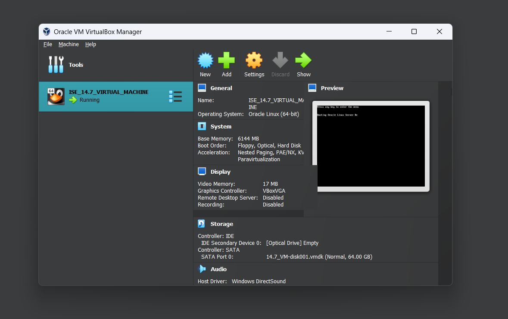
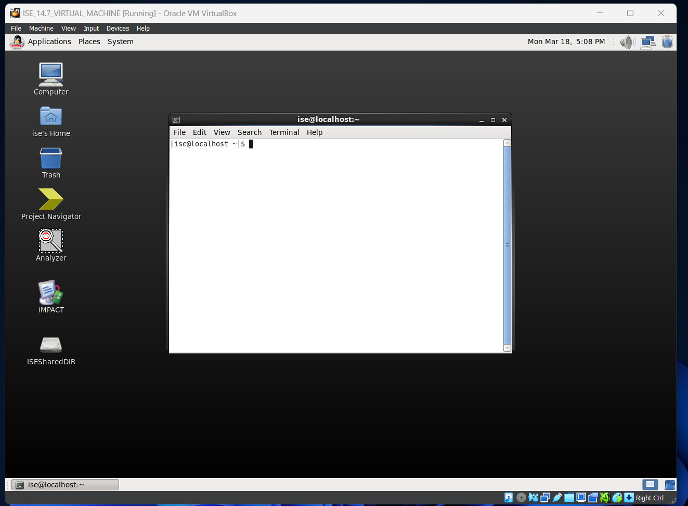
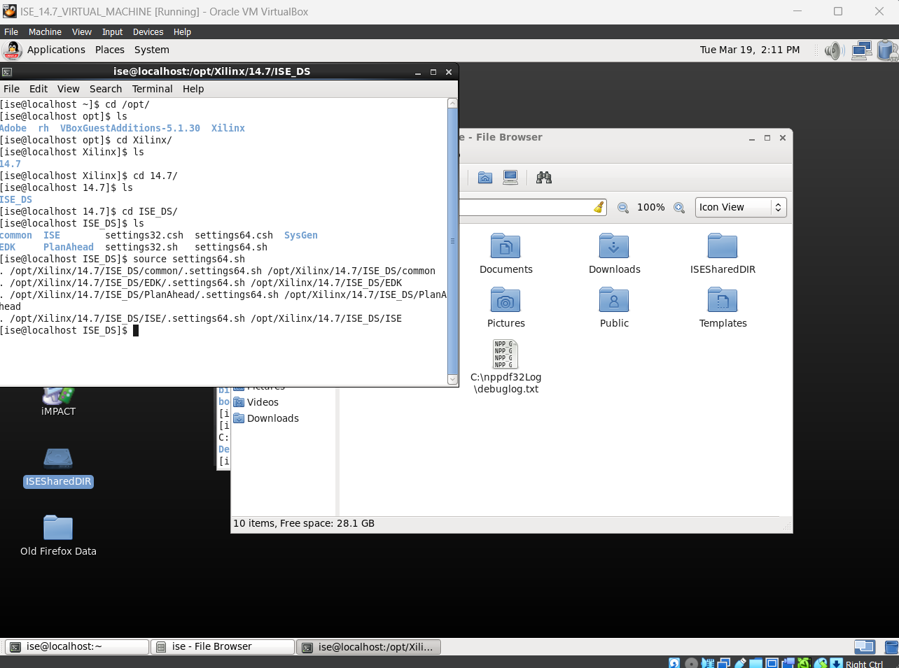

## <u>ISE Setup</u>

[A useful guide](https://web.cs.ucla.edu/~weightzero/files/xilinx_installation/InstallXilinxISE_VirtualBox.pdf)

1\. First install virtualbox on your windows 11 pc.

Install ISE for windows 11
[Link](https:/www.xilinx.com/support/download/index.html/content/xilinx/en/downloadNav/vivado-design-tools/archive-ise.html)

The B210 USRP uses ISE to modify the images that will be built and used on the
USRP itself.

2.1 Windows 11 bios fix: After this i had a problem where although i had
virtualization enabled in my bios the program would not continue so i simply
disabled the check for the virtualization by going to /bin/validate
virtualization and commented the line like so

2.2 After this simply install the ISE program onto the computer.

3.  Setup environment settings for ISE

## <u>Development Environment Setup</u>

Clone this repo containing all the necessary files. I recommend cloning into the
shared folder that you created earlier for ease of use of the final built image
as well as the fact that git is not installed on the VM that is prepared.

`git clone https://github.com/EttusResearch/fpga`

After cloning down these files one can simply use their terminal to go to the
cloned down repository and access the needed files. usrp3 serves as the top
level DIR for the Ettus b210 USRP.
