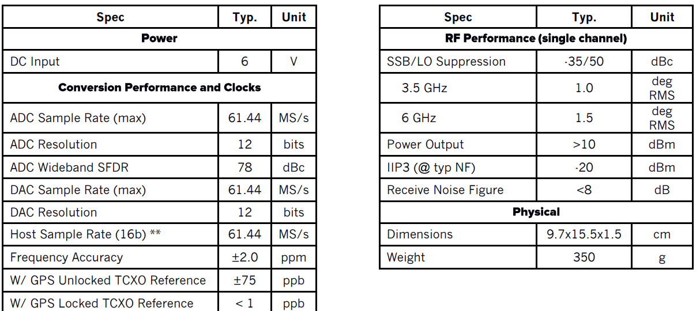
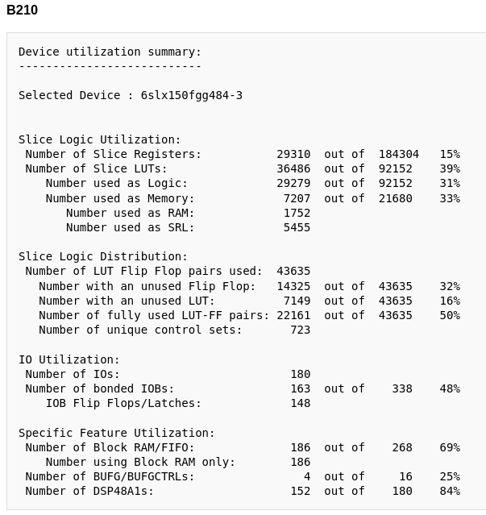
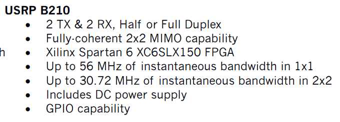

## Works Cited

Datasheet: [Link](https://www.ettus.com/wp-content/uploads/2019/01/b200-b210_spec_sheet.pdf)

Hardware Schematic B200/B210:
[Link](https://files.ettus.com/schematics/b200/b210.pdf)

Guide to modify image:
[Link](https://files.ettus.com/manual/md_usrp3_build_instructions.html)

## Features

- fully integrated, two-channel USRP device with continuous RF coverage from 70
  MHz – 6 GHz
- Full duplex, MIMO (2 Tx & 2 Rx) operation with up to 56 MHz of real-time
  bandwidth (61.44MS/s quadrature)
- USB 3.0 connectivity
- GNURadio and OpenBTS support through the open-source USRP Hardware Driver™
  (UHD)
- Open and reconfigurable Spartan 6 XC6SLX150 FPGA (for advanced users)
- Early access prototyping platform for the Analog Devices AD9361 RFIC, a fully
  integrated direct conversion transceiver with mixed-signal baseband

<h2 style="text-align: left;">High Level Architecture and Specs</h2>

         

